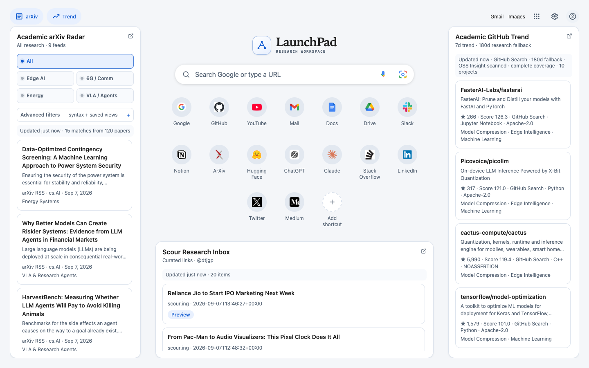

# LaunchPad

A Google-style research start page for Chrome. Search or open a URL, keep your shortcuts close, and scan arXiv, Scour and academic GitHub projects from one place.



## Install

Download a ZIP from [GitHub Releases](https://github.com/dtjgp/LaunchPad/releases), extract it into a permanent folder, and load that folder with **Load unpacked** in `chrome://extensions` (Developer mode enabled). Open a new tab or pin LaunchPad to use its popup.

See [INSTALL.md](INSTALL.md) for full installation, update and removal instructions. Chrome 114 or newer is required; current stable Chrome is recommended. Running the extension needs no Node.js, API key or LaunchPad account.

## What it does

- **Search and launch**: Google-only queries, direct HTTP(S)/local URLs, browser voice input when available, and Google Lens.
- **Shortcuts**: add, edit, remove and drag to reorder in the popup and new tab. Hover or focus a tile to find its More menu; right-click also works.
- **arXiv Radar**: four research tracks combine RSS categories and text filters. Advanced filters support phrases, AND/OR and grouped expressions, with clear syntax errors and saved views.
- **Scour Inbox**: connect a public profile in Settings. A new installation has no personal feed configured. Source changes do not reuse another profile's cached items.
- **Academic GitHub**: research-profile ranking over OSS Insight's seven-day candidate pool and GitHub Search fallbacks. The displayed source/window/coverage describe which data was actually available.
- **Themes and layout**: light, dark and system modes, adjustable research-panel visibility, responsive layouts and keyboard-accessible controls.

The research tracks cover Edge AI/model compression, communication systems, energy systems and VLA/research agents. Keyword matches and ranking scores help discovery; they do not assess paper quality. GitHub stars are total counts, not seven-day star growth.

## Daily use

| Action | How |
|---|---|
| Focus search | `Ctrl+K` / `⌘K` |
| Search or open the typed address | `Enter` |
| Close a dialog/menu or return to search | `Escape` |
| Edit a shortcut | More → Edit, or right-click |
| Reorder shortcuts | More → Edit shortcuts, then drag; use the pencil button in the popup |
| Show/hide research panels | arXiv / Trend controls at the top |
| Configure sources and appearance | Settings |

The account button opens configurable links to Google account pages. LaunchPad does not read your Google profile or sign-in status. You can optionally supply an HTTPS avatar image.

### Filter examples

```text
pruning OR quantization
("edge ai" OR "on-device") AND inference
energy AND (pricing OR "demand response")
```

Terms use case-insensitive text matching against title and abstract. AND takes precedence over OR. Quotes group phrases; parentheses group expressions. Comma or `&` means AND; semicolon or `|` means OR. The OR/AND selector controls the operator between adjacent terms. Invalid expressions are not applied or saved; the last valid view stays visible.

## Reliability and privacy

Settings are written locally before Chrome sync. Unrelated changes from another window are preserved; conflicting edits are reported. Feed status distinguishes cached results, partial updates, empty matches and failures. If a source is unavailable, retry or open its page directly.

Article previews request permission for the selected HTTPS origin. A redirecting page, login-only page or JavaScript-only article may need to be opened directly. Microphone availability and speech processing depend on your browser and its provider; Lens opens Google's website.

Read [PRIVACY.md](PRIVACY.md) for storage, external requests, voice input and permission controls, and [SECURITY.md](SECURITY.md) for reporting security issues.

## Develop and verify

Use Node.js 20+ (CI uses 22):

```sh
npm ci
npx playwright install chromium
npm run check
npm test
npm run test:ui
npm run build
npm run verify:package
```

Browser regressions use disposable Chromium extension profiles with real extension storage and controlled feed fixtures. Accessibility checks use axe-core. Real source checks are separate; automated tests do not prove microphone transcription, native permission-consent UI or external data quality.

The release ZIP uses an explicit runtime/legal file allowlist. It includes no npm dependencies, test fixtures or local audit traces. Build output and local test evidence are ignored by Git.

See [CONTRIBUTING.md](CONTRIBUTING.md), [release instructions](docs/RELEASING.md), [CHANGELOG.md](CHANGELOG.md) and [third-party notices](THIRD_PARTY_NOTICES.md).

## Project structure

| Files | Responsibility |
|---|---|
| `manifest.json`, `background.js` | Extension entry points, permissions and bounded source requests |
| `core.js`, `shared.js`, `design-tokens.css` | URL/settings validation, persistence, shared presentation and themes |
| `filter-query.js`, `arxiv-research.js`, `academic-trend.js` | Filter syntax, research presets and discovery ranking |
| `newtab/`, `popup.html`, `popup.js`, `styles.css` | Browser interfaces |
| `tests/`, `scripts/`, `.github/workflows/` | Verification and release packaging |

## Troubleshooting

- **The new tab has not changed after an update**: reload the extension and open a fresh tab. Update files in the same permanent folder to preserve an unpacked extension's identity.
- **No Scour items**: configure a public profile URL and check its source page. Login-only content is not a supported feed.
- **GitHub/arXiv shows cached or partial data**: a source may be unavailable or rate-limited. The label describes the available evidence; retry later.
- **A save fails**: input remains available. Fix the displayed validation/storage problem and retry. If another window changed the same setting, reload the page before saving again.
- **A preview fails**: check the requested site permission or open the article directly. Redirects are rejected for preview requests.

For a bug report, include browser/OS, release version, reproduction steps and a screenshot with personal information removed. Do not attach full storage dumps or private URLs.

LaunchPad is available under the [MIT License](LICENSE). Third-party assets retain their own licenses; see [THIRD_PARTY_NOTICES.md](THIRD_PARTY_NOTICES.md).
